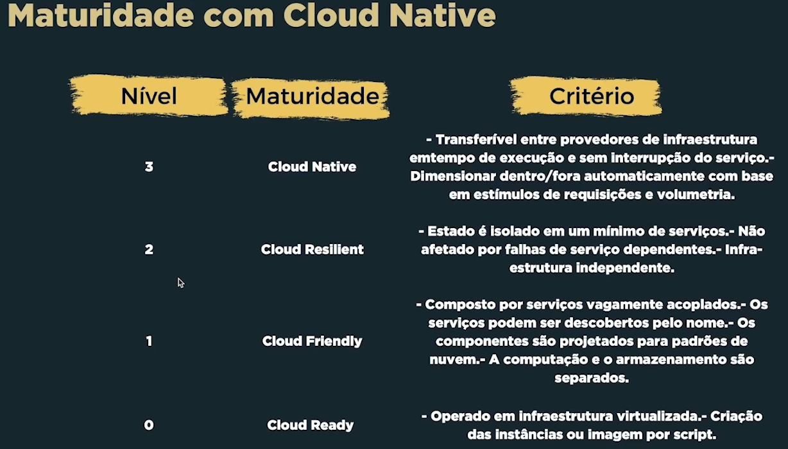

# Microsserviços

Repositório dedicado às atividades e projetos desenvolvidos na disciplina de `Microsserviços` do Curso de [Pós-Graduação em Desenvolvimento Full Stack da PUCRS](https://online.pucrs.br/pos-graduacao/desenvolvimento-full-stack).

## Sobre a Disciplina

Estudo sobre a arquitetura de microserviços. Estudo sobre os conceitos de particionamento de serviços, replicação e distribuição, comunicação assíncrona via filas e
Soluções serveless.

## Conceitos

> SOA: abordagem arquitetural corporativa que permite a criação de serviços de negócio interoperáveis que podem ser facilmente reutilizados e compartilhados entre aplicações e empresas.

> Benefícios:

- Desacoplamento;
- Favorece o reúso;
- Infraestrutura de plataforma.

> Two pizzas team: `Se um a equipe não pode ser alimentada por duas pizzas, é grande demais para discutir ideias (Jeff Bezos)`

> `Everything fails all the time (Werner Vogels)`

> `Lock-in`: Cenário em que se adquire uma tecnologia e depois se vê impossibilitado de trocá-la por outra`

> `On boarding`: Ambientação

---

### Cloud native maturity

---

### Modelo Produtor-consumidor

> `Pub/Sub (Publisher/Subscriber): É um serviço de mensanges em tempo real totalmente gerenciado que permite o envio e o recebimento de mensanges entre aplicativos independentes

> `Message Broker`: 
- sistema especializado em recepção e envio de mensagens;
- desconhece detalhes sobre os pub/sub;
- capazes de persistir mensagens;
- capazes de entregar novamente uma mensagem em caso de falha do consumidor;
- serviços de mensageria: Kafkam ActiveMQ, RabbitMQ, Amazon MQ, Google Pub/Sub, Azure Service Bus 

> `AMQP (Advanced Message Queuing Protocol)`: é um protocolo de rede padrão aberto para mensagens entre aplicações. Ele define como as mensagens devem ser enviadas, recebidas e roteadas em uma rede, garantindo que as mensagens sejam entregues com confiabilidade e segurança. O AMQP é frequentemente usado em sistemas de mensagens distribuídas, como o RabbitMQ e o Azure Service Bus

### Aplicações serverless

- Necessitam de um servidor para executar;
- Não conhece o servidor que a executará;
- serverless geralmente é relacionado à Function as a Service - FaaS

## Estrutura do Repositório

- `/exercicios`: Diretório contendo as atividades práticas

## Tecnologias e Ferramentas Utilizadas

- Flyway: permite o versionamento e o gerenciamento do banco de dados.

- RabbitMQ: Message Broker

- DotEnv: Ferramente orquestradora de variáveis de ambiente de projeto TypeScript

- Knative: Knative é uma solução empresarial de código aberto para construir aplicativos sem servidor e orientados a eventos

## Aluno

- [Halisson Torres - GitHub](https://github.com/halissontorres)

- [Halisson Torres - Dockerhub](https://hub.docker.com/repository/docker/halissontorres/pos-graduacao-puc-rs/general)

## Licença

Este projeto está sob a licença [MIT](../LICENSE).

## Links adicionais

## Referências bibliográficas

- Domain Driven Design

## Docente

- Vinicius Soares
- Luis Fernando Planella Gonzalez

